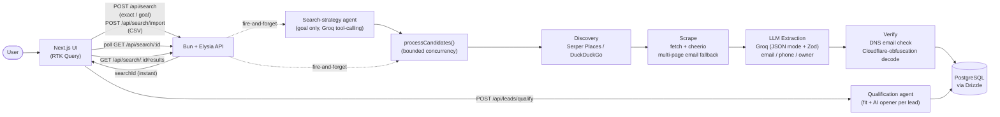

# Lead Discovery MVP

An AI lead-generation agent. Give it a keyword + location, a free-text goal ("find me
cleaning businesses in regional Australia with no website"), or your own list of
companies — it discovers or enriches real businesses, pulls structured contact info
(email, phone, owner) out of their own websites with an LLM, verifies what it finds,
judges each lead's fit against what you're selling, and drafts a personalized cold-outreach
opener for the ones worth contacting.

## Three ways to find leads

- **Exact search** — `keyword` + `location` (e.g. `"Cleaning Business"` / `"Australia"`),
  resolved directly against the discovery sources below.
- **Goal-based search** — a free-text goal (e.g. `"find plumbers in Leeds without a
  modern website"`). A search-strategy agent (`apps/api/src/services/searchAgent.ts`)
  runs a bounded tool-calling loop over Groq to plan and refine a keyword+location query
  before the rest of the pipeline runs — genuine multi-turn agent reasoning, not a fixed
  template.
- **CSV import** — upload a spreadsheet of businesses you already know about
  (`apps/api/src/lib/csvImport.ts`). Header matching is keyword/substring-based (e.g.
  "Website/URL", "Web Site", "Company Website" all resolve correctly), so it tolerates
  real-world export formats rather than requiring exact column names. Every row runs
  through the same scrape → extract → verify pipeline as a discovered lead, just skipping
  discovery itself since the business is already known.

All three converge on the same background pipeline and are polled by the frontend the
same way (`GET /api/search/:id`).

## Architecture



- **Frontend**: Next.js (App Router) + TypeScript + Tailwind CSS + Redux Toolkit + RTK Query.
  RTK Query polls `GET /api/search/:id` every 1.5s while a search is in progress, then fetches
  `GET /api/search/:id/results` once it completes. Qualification jobs are polled the same way.
- **Backend**: Bun + Elysia.js. Every search-creation route (`POST /api/search`,
  `POST /api/search/import`) returns a `searchId` instantly and kicks off work in the
  background (fire-and-forget) — errors are captured inside the pipeline itself and written
  back onto the search row, never thrown back at the original request.
- **Discovery**: `apps/api/src/services/discovery.ts`. Uses **Serper.dev's Places API**
  (Google Maps data, free trial credits) if `SERPER_API_KEY` is set — this returns real,
  already-identified businesses (name, address, phone, website, a stable Place ID) directly,
  which matters: a plain organic web search for "`<keyword>` in `<location>`" mostly surfaces
  "how to start a cleaning business" articles and forum threads, not actual businesses. Falls
  back to DuckDuckGo's HTML endpoint (free, no key required) if no Serper key is set, so the
  app works out of the box with lower precision. A country-bias setting
  (`SERPER_COUNTRY_BIAS`) disambiguates place names that exist in multiple countries (e.g.
  "Cambridge") without overriding already-unambiguous locations.
- **Scraping**: `apps/api/src/services/scrape.ts`. Plain `fetch` + `cheerio`, no headless
  browser. Falls back across a fixed list of likely contact-page paths
  (`/contact`, `/about`, …) when the homepage itself has no email, and decodes
  Cloudflare's email-obfuscation markup (`data-cfemail`) rather than relying on the LLM to
  guess it — caught live that an LLM would otherwise hallucinate the literal placeholder
  text as a real address. A business's own favicon is extracted as a lightweight logo,
  rather than calling a third-party logo API with the lead's domain.
- **LLM extraction**: `apps/api/src/services/extract.ts`. Uses **Groq** (OpenAI-compatible
  API, generous free tier) with JSON-mode prompts and Zod validation, model
  `openai/gpt-oss-20b`. Pulls email, phone, description, owner name/title, and social links
  out of scraped page text; any malformed response or non-business page is dropped rather
  than crashing the search. A generic plausibility filter (`lib/email.ts`) rejects
  hallucinated or placeholder-looking addresses from every extraction path.
- **Verification**: `apps/api/src/services/verifyEmail.ts` checks that an extracted email's
  domain can actually receive mail (MX/A record lookup) — DNS-only, not a live SMTP mailbox
  check, since port 25 is blocked on most networks this runs on. Leads also flag role-based
  addresses (`info@`, `contact@`) separately from named ones, since a named contact tends to
  get a better outreach response.
- **Dedup**: business-name normalization (legal-suffix/punctuation stripping) within a single
  search, plus Google's stable Place ID used to permanently exclude a business from ever
  resurfacing as "new" across *all* past searches, not just repeats of the same query. An
  imported CRM list of already-contacted domains (`excludedDomains`) extends the same
  exclusion to businesses outside this app's own history.
- **Qualification agent**: `apps/api/src/services/qualifyLeads.ts`. One LLM call per lead,
  batched as a background job the same shape as a search. Judges fit (`strong_fit` /
  `possible_fit` / `poor_fit`) against a free-text description of what you're offering, with
  reasoning, and drafts a ready-to-paste personalized outreach opener grounded in that
  lead's actual facts — left `null` for poor fits, since forcing a pitch for a mismatched
  offering produced incoherent copy in testing.
- **Pipeline**: `apps/api/src/services/pipeline.ts`. All three entry points
  (`runSearchPipeline`, `runAgentSearchPipeline`, `runCsvImportPipeline`) share one
  `processCandidates()` worker pool (bounded concurrency, 3 at a time) for the actual
  scrape → extract → verify → store work, with per-page error isolation so one bad URL
  never kills the whole search.

## Setup

```bash
# 1. Start Postgres (host port 5433, to avoid colliding with any local Postgres on 5432)
docker compose up -d

# 2. Copy env and fill in your keys
cp apps/api/.env.example apps/api/.env
# GROQ_API_KEY is required (free tier: https://console.groq.com)
# SERPER_API_KEY is optional but recommended (free trial: https://serper.dev)

# 3. Backend — install, push the schema, run the API (port 4000)
cd apps/api && bun install && bun run db:push && bun run dev

# 4. Frontend — in a second terminal, install and run the Next.js app (port 3000)
cd apps/web && bun install && bun run dev
```

See `apps/api/.env.example` for every configurable env var (candidate limits, country
bias, etc.) with explanations of what each one trades off.
